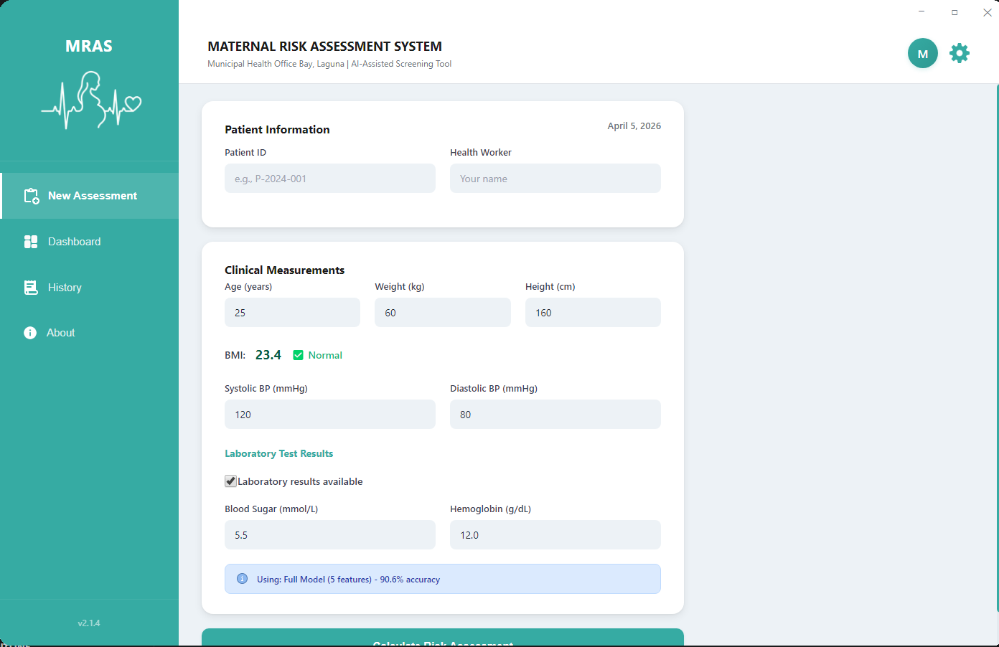
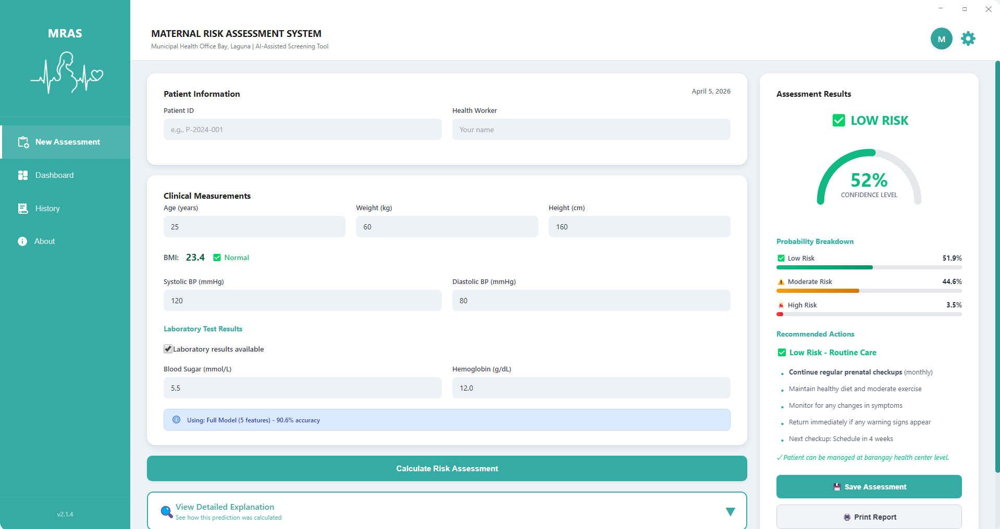
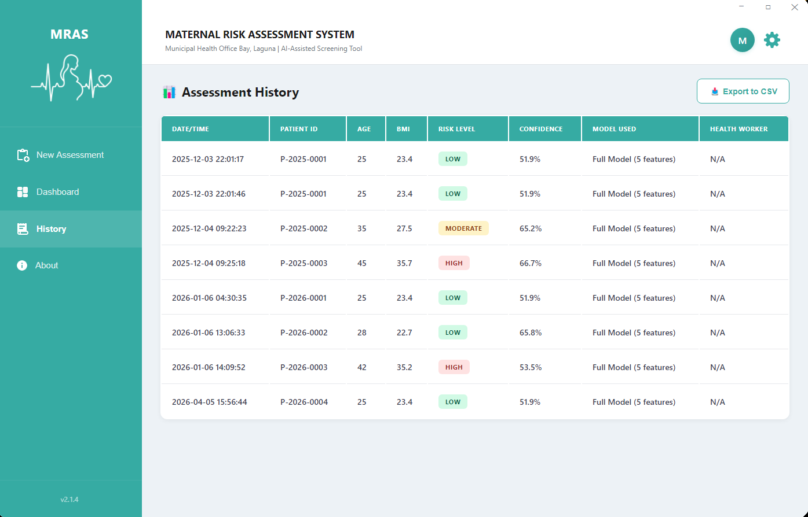

# Maternal Risk Assessment System (MRAS)

An AI-assisted desktop application for maternal health screening. It uses machine learning to classify pregnant women into Low, Moderate, or High risk categories based on clinical measurements and vital signs — enabling faster triage and referral decisions at health centers and clinics.

---

## Screenshots





---

## Features

- **Risk Assessment** — Predicts maternal risk level (Low / Moderate / High) with confidence scores and probability breakdown
- **Dual ML Model Support** — Automatically switches between:
  - **Full Model** (90.6% accuracy) — uses 5 features when lab results are available
  - **Basic Model** (89.9% accuracy) — uses only BMI and blood pressure for clinics without lab equipment
- **PDF Report Generation** — Generates professional medical reports with patient data, clinical measurements, risk classification, and health worker certification fields
- **Dashboard Analytics** — Risk distribution charts, weekly trends, and top risk factors across all assessments
- **Assessment History** — Searchable and sortable table of all past assessments with color-coded risk badges
- **Auto-generated Patient IDs** — Format: `P-YYYY-NNNN`, auto-increments within the year
- **Bilingual Interface** — English and Filipino (Tagalog) language support
- **Offline Capable** — No internet required; all data stored locally in CSV

---

## Tech Stack

| Layer | Technology |
|---|---|
| Language | Python 3 |
| GUI Framework | PyQt5 + QWebEngineView |
| UI (Frontend) | HTML5, CSS3, Vanilla JavaScript |
| Charts | Chart.js v4.4.0 |
| ML Models | Scikit-learn (Logistic Regression) |
| Data Handling | Pandas, NumPy |
| PDF Reports | ReportLab |
| Data Storage | CSV (local file) |
| Packaging | PyInstaller |

---

## ML Model Details

**Full Model — 5 Features:**
- BMI
- Systolic Blood Pressure
- Diastolic Blood Pressure
- Blood Sugar (mmol/L)
- Hemoglobin (g/dL)

**Basic Model — 3 Features:**
- BMI
- Systolic Blood Pressure
- Diastolic Blood Pressure

**Risk Labels:**
- `0` — Low Risk
- `1` — Moderate Risk
- `2` — High Risk

---

## Project Structure

```
MaternalRiskSystem-App/
├── maternal_risk_app.py            # Main application entry point
├── model_BEST_for_deployment.pkl   # Full 5-feature ML model
├── model_BASIC_for_deployment.pkl  # Basic 3-feature ML model
├── scaler.pkl                      # Feature scaler for full model
├── scaler_BASIC.pkl                # Feature scaler for basic model
├── model_config.json               # Full model metadata and feature ranges
├── model_config_BASIC.json         # Basic model metadata
├── assessment_history.csv          # Local storage for all assessments
├── ui/
│   ├── index.html                  # Main UI layout
│   ├── styles.css                  # Styling
│   └── app.js                      # Frontend logic and backend communication
├── assets/                         # Icons, logos, and UI images
└── test/
    ├── lowrisk.txt                  # Sample low-risk test cases
    ├── moderaterisk.txt             # Sample moderate-risk test cases
    └── highrisk.txt                 # Sample high-risk test cases
```

---

## Installation & Setup

### Prerequisites
- Python 3.8 or higher
- Windows (recommended), Linux, or macOS

### Steps

**1. Clone the repository**
```bash
git clone https://github.com/sie-hanamura/MaternalRiskSystem-App.git
cd MaternalRiskSystem-App
```

**2. Create a virtual environment**
```bash
python -m venv .venv

# Windows
.venv\Scripts\activate

# Linux / macOS
source .venv/bin/activate
```

**3. Install dependencies**
```bash
pip install PyQt5 PyQtWebEngine pandas numpy scikit-learn reportlab
```

**4. Run the application**
```bash
python maternal_risk_app.py
```

---

## Building a Standalone Executable

To create a distributable `.exe` (Windows):

```bash
pip install pyinstaller
pyinstaller MRAS.spec
```

The output will be in the `dist/MRAS/` folder.

> **Note:** The `dist/` and `build/` folders are excluded from this repository. Build them locally using the steps above.

---

## Usage

1. Launch the app with `python maternal_risk_app.py`
2. Go to **New Assessment**
3. Enter patient information and clinical measurements
4. If lab results (blood sugar, hemoglobin) are available, input them — the full model will be used automatically
5. Click **Assess Risk** to get the prediction
6. Optionally generate a **PDF Report** or **Save** the assessment to history
7. View trends and statistics on the **Dashboard**

---

## Disclaimer

This system is intended as a **decision-support tool only**. It does not replace professional medical judgment. All assessments should be reviewed and confirmed by a qualified healthcare provider.

---

## Version

v2.1.4
